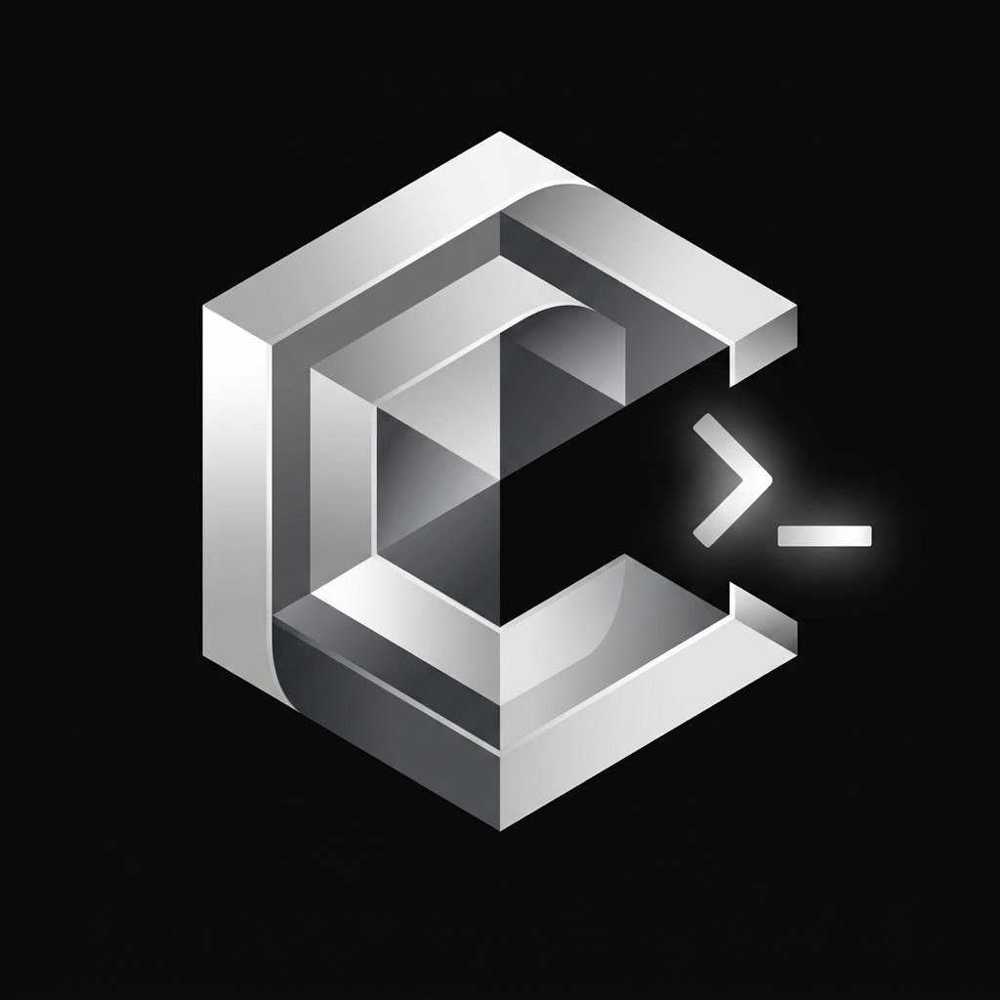

<div align="center">
  
  <h1>Clipak</h1>
  <p><strong>Unconfined developer tool delivery for atomic Linux operating systems</strong></p>
</div>

---

Clipak is a system for building, distributing, and running developer tools on Linux.

It is designed for atomic and immutable operating systems—such as Fedora Silverblue and Kinoite, SteamOS, Fedora CoreOS, and openSUSE MicroOS/Aeon—where low-level utilities (debuggers, profilers, kernel tracers, compilers) cannot run inside traditional desktop sandboxes and should not be layered onto the base OS image.

Tools are delivered as systemd-compliant **Discoverable Disk Images (DDIs)** with **dm-verity** cryptographic verification and executed within private mount namespaces that leave host processes, networks, and hardware fully accessible.

---

## Key Concepts

- **Unconfined Execution**: Unlike desktop sandboxes, Clipak preserves the host's PID, network, IPC, and device namespaces. Tools like `gdb`, `strace`, `bpftrace`, and `perf` can inspect host processes and kernel interfaces without restriction.
- **Discoverable Disk Images**: Packages follow the systemd UAPI Discoverable Partitions Specification, mounting a read-only rootfs at `/app` alongside a shared `/usr` runtime.
- **Cryptographic Integrity**: Images include dm-verity Merkle trees and PKCS#7 digital signatures, verified automatically before execution.
- **Host Integration**: Exported binaries are automatically registered as launcher shims in `~/.local/share/clipak/bin`, making them available directly in your shell.

---

## Basic Usage

Clipak uses a familiar, Flatpak-like command-line interface:

```bash
# Search configured repositories
clipak search strace

# Install a package or local .ddi image
clipak install org.kernel.strace
clipak install ./fastfetch.ddi

# List installed tools
clipak list

# Inspect package details and declared host capabilities
clipak info org.kernel.strace

# Run an installed tool (also callable directly via shell shims)
clipak run org.kernel.strace -p 1234

# Update repository catalogs
clipak update

# Manage repositories
clipak remotes
clipak remote-add my-repo https://example.com/repo/repository
clipak remote-delete my-repo

# Uninstall a tool
clipak uninstall org.kernel.strace
```

---

## Building from Source

### Requirements

- Rust 1.80+
- OpenSSL development headers
- Bubblewrap (`bwrap`)

### Build & Install

```bash
git clone https://github.com/LoganBaird-Levenick/clipak.git
cd clipak
cargo build --release
install -Dm755 target/release/clipak ~/.local/bin/clipak
```

Run `clipak repair` once after installation to ensure environment shims and profile scripts are in place.

---

## License

Licensed under either of:

- Apache License, Version 2.0 ([LICENSE-APACHE](LICENSE-APACHE) or <http://www.apache.org/licenses/LICENSE-2.0>)
- MIT License ([LICENSE-MIT](LICENSE-MIT) or <http://opensource.org/licenses/MIT>)

at your option.
